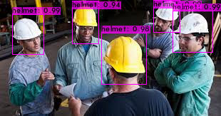

# HardHat Detection with YOLOv4 (Cloud-Tutorial)

This repository walks you through how to Build, Train and Run YOLOv4 Object Detections on a custom HardHat detection dataset with Darknet in the Cloud through Google Colab.

To follow along with the exact tutorial upload this entire repository to your Google Drive home folder. Then follow along with the notebook by opening it within Google Colab.

### YOLOv4 Video Example

